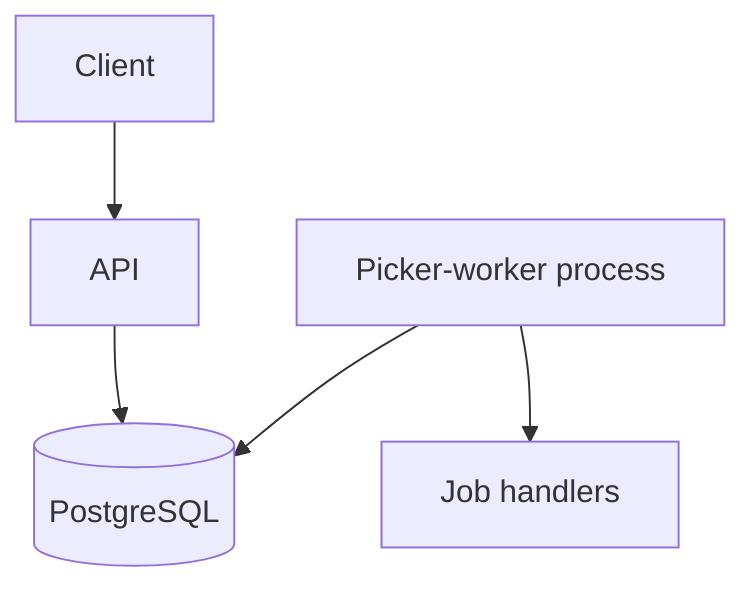

# Architecture

> Status: Proposed design. This document describes the intended implementation.

jobq uses PostgreSQL for durable job storage and coordination. The API submits jobs; a combined picker-worker process claims and executes them.

## Components

| Component | Responsibility |
|---|---|
| API | Validate submissions and expose job management operations |
| Repository | Persist jobs and perform atomic state transitions |
| Picker | Claim eligible jobs within available execution capacity |
| Executor | Run handlers, renew leases, and record outcomes |
| Recovery loop | Recover expired leases |

## Claiming jobs

Claim jobs in a short database transaction using a locking selection and an `UPDATE ... RETURNING`.

Eligible jobs are pending and scheduled for execution. Selection orders by descending priority, ascending scheduled time, and job ID as a tie-breaker.

`FOR UPDATE SKIP LOCKED` allows multiple processes to claim different jobs concurrently. Commit the claim before executing the handler.

Claim only as many jobs as the executor can start promptly.

## Leases and ownership

Each claim assigns a unique ownership token and a lease expiry.

Lease renewal, completion, and failure updates must match the current ownership token. This prevents an expired worker from overwriting a newer attempt's state.

Recover expired leases through an atomic transition governed by the retry policy.

## Execution guarantees

Execution is at least once. A handler may execute again after a crash or lease expiry, including when its external side effects already succeeded.

Handlers must make duplicate execution safe. Claim tokens protect database state; they do not prevent duplicate external side effects.

## Scaling

Run multiple picker-worker processes against the same database. Each process has a bounded local executor.

Global execution order is not guaranteed with concurrent workers. Sustained high-priority traffic may delay lower-priority jobs.
