# Job Lifecycle

> Status: Proposed design.

## States

| State | Meaning |
|---|---|
| `pending` | Waiting for its scheduled time and available capacity |
| `running` | Claimed by a worker with an active lease |
| `completed` | Handler finished successfully |
| `failed` | Terminal failure; no more automatic attempts |

```mermaid
stateDiagram-v2
    [*] --> Pending
    Pending --> Running: Claim
    Running --> Completed: Success
    Running --> Pending: Retry scheduled
    Running --> Pending: Lease expired; attempts remain
    Running --> Failed: Permanent failure or attempts exhausted
    Completed --> [*]
    Failed --> [*]
```



## Attempts

Increment the attempt count when a job is claimed. The maximum attempt count includes the initial execution.

For example, a maximum of three attempts permits one initial execution and two retries.

## Retries

Retry transient failures using capped exponential backoff with jitter:

```text
delay = random(0, min(max_delay, base_delay * 2^(attempt - 1)))
```

Persist the next scheduled time and return the job to `pending`. Permanent failures and exhausted attempts transition to `failed`.

## Leases

Renew leases while handlers execute. If a worker crashes or stops renewing, the recovery loop makes the job eligible for another attempt or marks it failed when attempts are exhausted.

Updates from an older claim must not modify the current attempt.

## Timeouts

Execution timeouts and lease expiry serve different purposes:

- Execution timeouts limit handler duration.
- Lease expiry detects lost worker ownership.

Cancellation of a handler does not guarantee cancellation of external operations. Handlers must remain safe to retry.

## Failed jobs

Retain terminal failures for inspection. Manual requeue behavior, cancellation, and retention policies are not yet defined.
